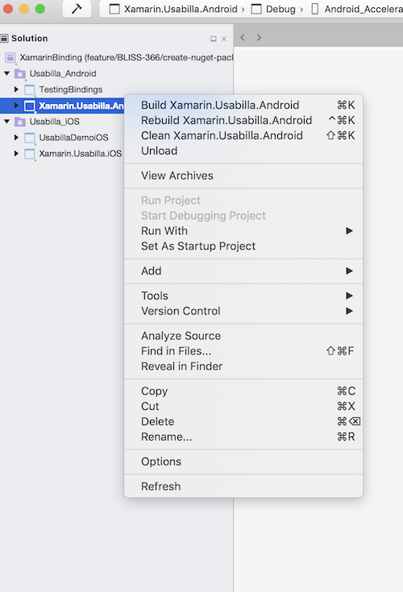

# Usabilla for Xamarin - creating a nuget-package

## To build the Nuget-package for Android & iOS  (combined nuget package) do the following:

- Open the Visual Studio file `XamarinBinding.sln` located in the 'UsabillaBindings' folder
- Select and build the Xamarin.Usabilla.Android

	

- Select and build the Xamarin.Usabilla.iOS

	

- Open a `Terminal`
- Navigate to the `Nuget-Package` folder 
- Issue the nuget command pack `nuget pack`

The result is a nuget package `Usabilla.x.x.x.nupkg` that can be included in your project

## Updating versions

The `Usabilla.nuspec` needs to be updated if the dependencies change, or when updating the version number
